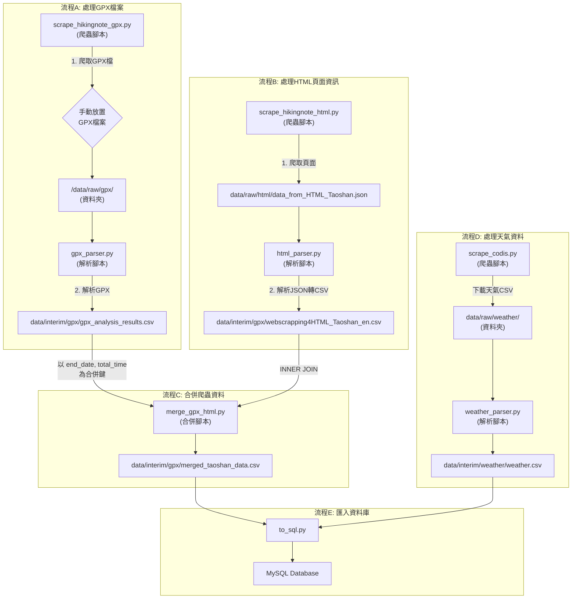

```
mountain_time_predict/
├── data/                         # 資料夾
│   ├── interim/                  # 中間處理資料 (準備寫進DB的)
│   ├── processed/                # 最終處理後資料 (ml建模前的最終dataframe?)
│   └── raw/                      # 原始資料 (CSV, GPX ...)
│
├── notebook/                     # JupyterNotebook 測試跟分析
│
├── sql/                          # SQL 初始化腳本
│   └── init.sql
│
├── src/                          # Python 原始程式碼
│   ├── __init__.py
│   │
│   ├── config.py                 # 存重要變數 路徑、sql連線設定
│   │
│   ├── data_process/             # for 資料處理
│   │   ├── to_sql.py             # 把 interim 的 CSV 寫進 DB
│   │   ├── gpx_parser.py         # GPX 解析腳本
│   │   ├── html_parser.py        # HTML 解析腳本
│   │   ├── merge_gpx_html.py     # 合併 GPX 與 HTML
│   │   └── weather_parser.py     # 天氣 raw data 整理寫進 interim
│   │
│   └── scraping/                 # for 爬蟲
│       ├── scrape_hikingnote_gpx.py   # 爬 HikingNote GPX
│       ├── scrape_hikingnote_html.py  # 爬 HikingNote 頁面
│       ├── scrape_codis.py           # 爬天氣月報表
│       └── scrape_stations.py           # 爬氣象站資訊 靜態表/一次性
│
├── .env                          # 環境變數設定檔 密碼、金鑰啥的
└── README.md                     
```

## 如何執行 py 檔
在專案根目錄執行，例如：

```bash
python -m src.data_process.weather_parser
```

## 資料流示意圖

